# Formal Verification of an AHB-to-APB Bridge

Formal (assertion-based) verification of an **AHB-to-APB bridge** using **SystemVerilog Assertions (SVA)**, carried out with two industry formal tools — **Synopsys VC Formal** and **Cadence JasperGold**. Developed for **ECE 560: Assertion Based Verification** (Fall 2024, Portland State University).

**Team 3:** Bhavana Manikyanahalli Srinivasegowda, Harsha Vardhan Duvvuru, Lokarjun Ramesh, Venkata Vyshnavi Julakanti

> RTL source code is based on the open AHB-to-APB bridge by prajwalgekkouga (see References). This repository focuses on the **formal verification environment** — assumptions, assertions, cover properties, X-propagation checks, and the tool run scripts — built around that RTL.

---

## Introduction

The AHB-to-APB bridge is a key element of ARM's AMBA bus framework, acting as the gateway between high-speed system components and low-power peripherals. The **AHB** (Advanced High-performance Bus) supports pipelining, bursts, and high-bandwidth transfers for CPUs, memory controllers, and DMA engines, while the **APB** (Advanced Peripheral Bus) is a simple, non-pipelined, low-power protocol for timers, UARTs, GPIO, and similar peripherals. Because the two buses differ significantly in timing and control complexity, the bridge translates pipelined AHB transactions into the two-phase (SETUP → ENABLE) APB protocol using a control FSM that manages address latching, phase sequencing, and wait-state insertion via `PREADY`/`HREADYOUT` handling.

Because the bridge sits between two fundamentally different protocols, its correctness is critical — which is where **formal verification** is indispensable. Unlike simulation, which exercises a limited set of stimulus, formal verification exhaustively explores all legal input conditions, FSM transitions, and handshake interactions, and either proves a property holds under every valid scenario or produces a counterexample (CEX) when it does not. This catches subtle corner-case bugs (back-to-back transfers, stalled `PREADY`, misaligned `HTRANS`) that are easy to miss in simulation.

## Block Diagram

The bridge takes AHB-side inputs (`HCLK`, `HRESETn`, `HTRANS`, `HWRITE`, `HSELAPBif`, `HREADYin`, `HWDATA`, `HADDR`) and produces APB-side outputs (`PENABLE`, `PWRITE`, `PWDATA`, `PADDR`, `PSELx`) through a state machine, an address-decode block, and registered (DFF) outputs, returning `HRDATA`, `HREADYout`, and `HRESP` to the AHB side.

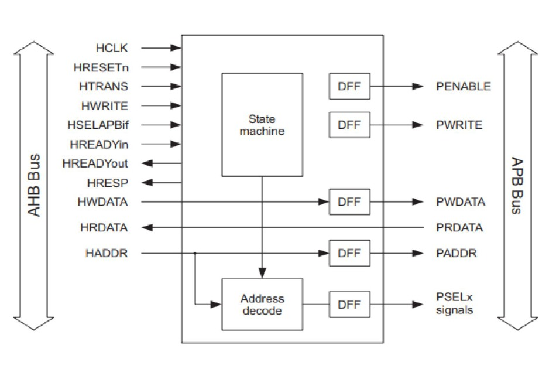

## Timing Diagrams

The bridge converts each AHB transfer into a two-phase APB transfer. A basic read or write takes three cycles (1 cycle to latch the address/data + 2 APB cycles); with two wait states (by holding `HREADYout = 1`) it takes five cycles.

| Write (3 cycles) | Write with 2 wait states (5 cycles) |
|---|---|
| 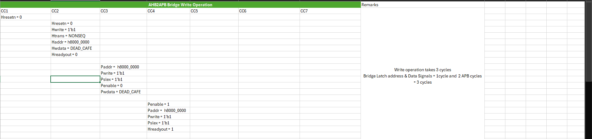 | 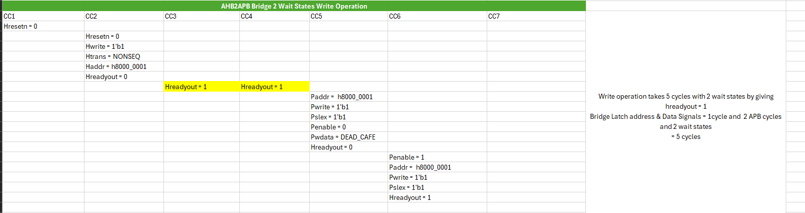 |

| Read (3 cycles) | Read with 2 wait states (5 cycles) |
|---|---|
| 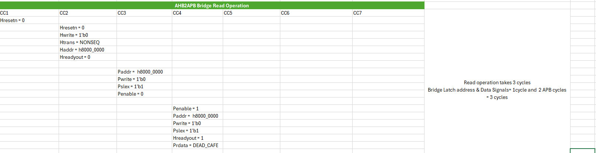 | 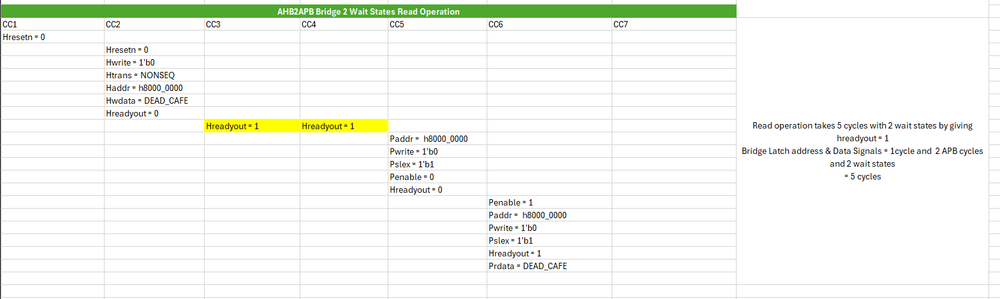 |

---

## Formal Verification Test Plan

The test plan exhaustively validates functional correctness and protocol compliance across all legal input scenarios:

1. **Input constraints (assumptions)** restrict the formal tool to legal AHB stimulus — valid `HTRANS` encodings, in-range addresses, and protocol-compliant transaction sequencing — so the solver explores every corner case within the legal space without drifting into illegal behavior.
2. **Protocol assertions (SVA)** check rules such as one-hot peripheral selection, correct SETUP/ENABLE phase behavior, correct read/write transfers, `HRESP`/`HREADYOUT` timing, and the direct correspondence between `HRDATA` and `PRDATA`. Particular focus is placed on the APB control FSM — verifying every output in each state and all legal transitions across the eight states.
3. **Cover properties** confirm reachability and completeness — that both FSMs visit all valid states and that every intended transition is exercised, ruling out dead or unreachable states.

In total the environment defines **6 assumptions, 33 assertions, and 10 cover properties**, plus a dedicated set of **X-propagation assertions**.

## Assumptions (Input Constraints)

Defined in `bridge_assumptions.sva` (JasperGold) and within `bridge_assertions_assumptions.sv` (VC Formal):

1. **`HTRANS` valid values** — restricts `HTRANS` to IDLE (`00`), NONSEQ (`10`), and SEQ (`11`), preventing the illegal `01` encoding.
2. **Valid address range** — when a transfer occurs (`HTRANS != IDLE`), the address must lie within the bridge's peripheral window `0x8000_0000`–`0x8C00_0000`, preventing out-of-range decode and limiting state explosion.
3. **NONSEQ start** — every new AHB transaction must begin with a NONSEQ transfer, per the AMBA spec.
4. **IDLE after NONSEQ** — each NONSEQ transfer is followed by an IDLE cycle, modeling a clean single-beat request and minimizing combinational explosion during early proofs.

## Assertions

Grouped into three categories (defined in `bridge_assertions.sva` / `bridge_assertions_assumptions.sv`):

- **Functional correctness (AHB intent → APB response):** e.g. on a read, `Pwrite=0`, `Penable=1`, `Pselx!=0`; on a write, `Paddr == Haddr` (per pipeline stage), `Pwdata == Hwdata`, `Pwrite=1`. Includes `assert_pselx_onehot_encoding`, `assert_read_data_passthrough`, `assert_response_always_okay`, and the per-slave select checks `assert_select_slave1/2/3` (address-range → one-hot `tempselx`).
- **Handshake timing:** enforces the two-phase APB ordering — `Penable` de-asserted in SETUP and asserted one cycle later in ENABLE (`assert_penable_protocol`, `assert_read_phase`, `assert_write_phase`), and `Hreadyout` low during SETUP / high in ENABLE (`assert_hreadyout_timing`).
- **FSM transition legality:** guarantees only valid transitions occur (e.g. `IDLE→READ`, `IDLE→WWAIT`, `WWAIT→WRITE/WRITEP`, `READ→RENABLE`, `WRITE→WENABLE`, `WENABLEP→…`) under the correct `valid`, `Hwrite`, and `Hwritereg` conditions, and that no illegal/unreachable transitions happen (`assert_fsm_valid_states`, `assert_transition_*`).

## Cover Properties

Ten cover properties (`bridge_cover_properties.sva`) confirm reachability of both FSMs and their key transitions — AHB states (IDLE, WWAIT) and transitions (`idle→wait`, `wait→idle`), and APB states (SETUP, ENABLE, WWAIT) and transitions (`setup→enable`, `enable→wwait`, `wwait→enable`) — proving the assertions are evaluated under all relevant conditions and that no FSM logic is unreachable.

## X-Propagation Assertions

A dedicated set of X-propagation checks (`bridge_xprop_assertions.sva`, run via JasperGold's X-prop app) ensures no unknown (`X`) values leak into the APB bus or control path after reset: `xprop_pselx`, `xprop_penable`, `xprop_pwrite`, `xprop_hreadyout`, `xprop_fsm_state` (the FSM `PRESENT_STATE` is always a known/legal value), `xprop_valid`, and `xprop_paddr` (PADDR fully defined whenever a PSEL bit is active). An earlier `PWDATA` X-check was removed because its precondition was unreachable, and replaced with these reachable checks.

---

## Results

### FPV (Formal Property Verification)

All properties were run in VC Formal's FPV app. The initial run showed **4 failing assertions** — `assert_select_slave1/2/3` and `assert_valid_signal` — due to a timing mismatch in the implication operator.

| Property goal list (part 1) | Property goal list (part 2) |
|---|---|
| 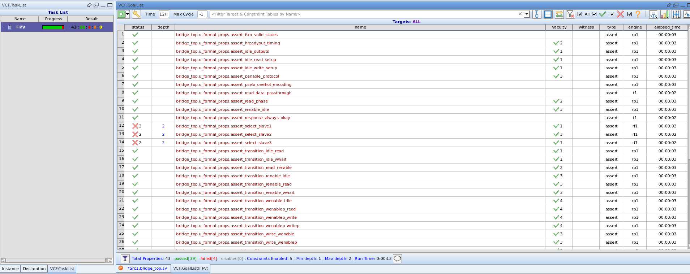 | 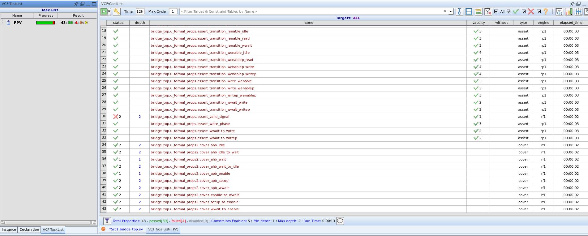 |

**Correction:** the four properties used a non-overlapping implication (`|=>`) where the design's sensitivity list (`Haddr`, `Hresetn`) requires checking values in the *same* clock cycle. Switching to the overlapping implication operator (`|->`) made all four pass. After correction, **all 43 properties pass** (39 assertions + 10 covers shown as 43 total goals; passed[43], failed[0]):

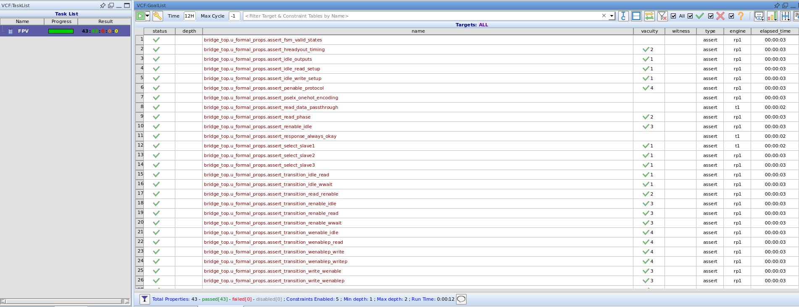

### Bug Injection

To validate the assertions themselves, bugs were intentionally injected and the assertions successfully caught them with counterexample waveforms:

- The `valid` signal was forced to `1'bx` (should be `1`). `assert_valid_signal` caught it:

  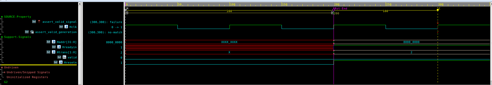

- The `tempselx` for the `0x8800_0000`–`0x8C00_0000` range was forced to `3'b101` (not one-hot). `assert_pselx_onehot_encoding` caught it (and the corresponding slave-select assertion also failed):

  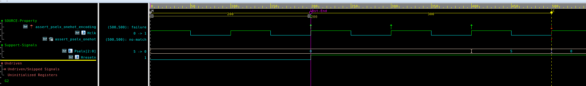

### AEP (Automatic Extracted Properties)

VC Formal's AEP app automatically generated **8 FSM deadlock-safety properties** across the APB controller states. **7 were proven** and **1 was inconclusive** (insufficient constraints / incomplete reachability). The tool reported a structural model of **967 inputs and 226 registers**, and the deadlock waveforms confirmed the FSM can exit critical states (IDLE, READ, WRITE) without freezing.

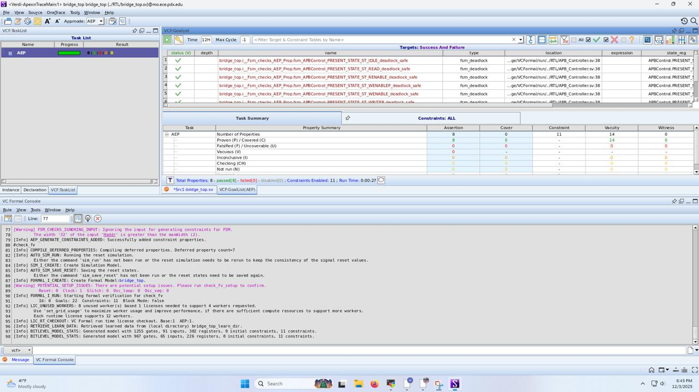

### FXP (X-Propagation in JasperGold)

JasperGold's X-Propagation Verification app proved all X-prop properties — **7 assertions proven and 7 related covers covered** — confirming the bridge's outputs and FSM state remain deterministic (free of unknown values) after reset.

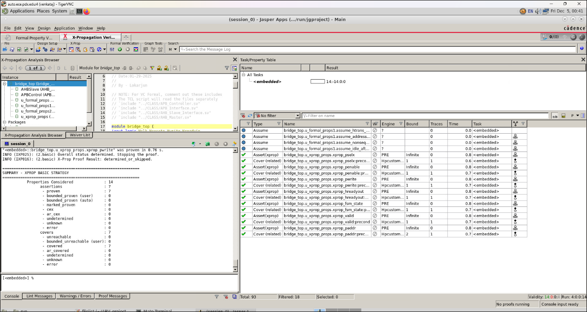

---

## Repository Structure

The project provides the same verification effort set up for **two formal tools**:

```
ECE-560--Formal-Verification-of-an-AHB2APB-Bridge/
├── JGFormal/                       # Cadence JasperGold flow
│   ├── RTL/
│   │   ├── AHB_Master.sv
│   │   ├── AHB_Slave_Interface.sv
│   │   ├── APB_Controller.sv       # APB control FSM (8 states)
│   │   ├── APB_Interface.sv
│   │   ├── bridge_top.sv           # DUT top
│   │   ├── bridge_assertions.sva       # 30 functional/timing/FSM assertions
│   │   ├── bridge_assumptions.sva      # 4 input-constraint assumptions
│   │   ├── bridge_cover_properties.sva # 10 cover properties
│   │   ├── bridge_xprop_assertions.sva # 7 X-propagation assertions
│   │   ├── bridge_bind_file.sva        # binds the property modules to the DUT
│   │   └── filelist
│   └── run/
│       └── jg_fxp_run.tcl          # JasperGold X-prop run script
└── VCFormal/                       # Synopsys VC Formal flow
    ├── RTL/
    │   ├── AHB_Master.sv
    │   ├── AHB_Slave_Interface.sv
    │   ├── APB_Controller.sv
    │   ├── APB_Interface.sv
    │   ├── bridge_top.sv
    │   ├── bridge_assertions_assumptions.sv  # assumptions + assertions
    │   ├── bridge_bind_file.sv
    │   └── filelist
    └── run/
        ├── run_fpv.tcl             # FPV (formal property verification)
        └── run_aep.tcl             # AEP (automatic extracted properties)
```

The properties are written in separate modules and connected to the DUT (`bridge_top`) using SystemVerilog **bind** files, so the verification IP stays cleanly separated from the RTL.

## How to Run

### VC Formal

```
# Formal Property Verification (assertions + covers)
vcf -f run/run_fpv.tcl

# Automatic Extracted Properties (FSM deadlock safety)
vcf -f run/run_aep.tcl
```

`run_fpv.tcl` sets the app to FPV, reads the design via `../RTL/filelist`, creates the clock (`Hclk`, period 10) and active-low reset (`Hresetn`), then runs the reset simulation and saves the reset state. `run_aep.tcl` sets the AEP app with `all+fsm_deadlock` and enables FSM-report/state-extraction options.

### JasperGold (X-Propagation)

```
jg run/jg_fxp_run.tcl
```

`jg_fxp_run.tcl` analyzes the RTL plus the assertion/assumption/cover/xprop files, enables X-prop checking (`check_xprop -init`), elaborates `bridge_top`, sets the clock and active-low reset, selects the proof engines, and runs `prove -all`.

## Challenges

- **Implication operator timing:** four assertions failed initially because they used non-overlapping implication where the design's combinational sensitivity list (`Haddr`, `Hresetn`) required same-cycle evaluation; switching to overlapping implication fixed all four.
- **Constraint balancing:** finding the minimal-but-sufficient set of assumptions to avoid both unrealistic stimulus and over-constraining the design required iterative refinement, since small changes significantly affected proof convergence.
- **Assertion precision and coverage closure:** writing non-redundant, intent-accurate assertions and guiding the engine to deep/dependent states required targeted cover properties.

## Conclusion

The formal verification exhaustively proved the AHB-to-APB bridge's APB handshakes, timing sequences, and FSM transitions against AMBA expectations under all valid conditions. Combining input assumptions, protocol assertions, FSM-transition checks, cover properties, X-propagation checks, AEP deadlock analysis, and deliberate bug injection produced high confidence in the design's correctness and robustness, and demonstrated how formal methods complement simulation by delivering exhaustive correctness guarantees.

## References

- RTL source: https://github.com/prajwalgekkouga/AHB-to-APB-Bridge
- ARM AMBA AHB/APB protocol specifications.
